# Hi there, I'm Laurence 👋

A passionate full-stack developer based in Sydney, Australia. I write **Java**, **TypeScript**,
**Vue** and **React** — and spend a fair amount of time breaking things on **AWS** and **Cloudflare**.

### Tech I reach for

### Things I've built

| Project | What it is |
| --- | --- |
| **[simple-photo-albums](https://github.com/LaurenceHo/simple-photo-albums)** · [live](https://simple-photo-albums.pages.dev) | A full-stack photo album app — Vue 3 and PrimeVue on Cloudflare Pages, a Hono API on Workers, with D1 and R2 behind it. |
| **[react-weather-app](https://github.com/LaurenceHo/react-weather-app)** | A weather application built with React, Redux, TypeScript, Ant Design, ECharts and Firebase. |
| **[electron-quasar-trip-management](https://github.com/LaurenceHo/electron-quasar-trip-management)** | A cross-platform desktop trip planner, built with Electron and Quasar. |

### My GitHub stats

<!--
  These cards are SVG files generated by .github/workflows/stats.yml and committed
  into this repository, rather than fetched from a third-party host at page load.
-->

